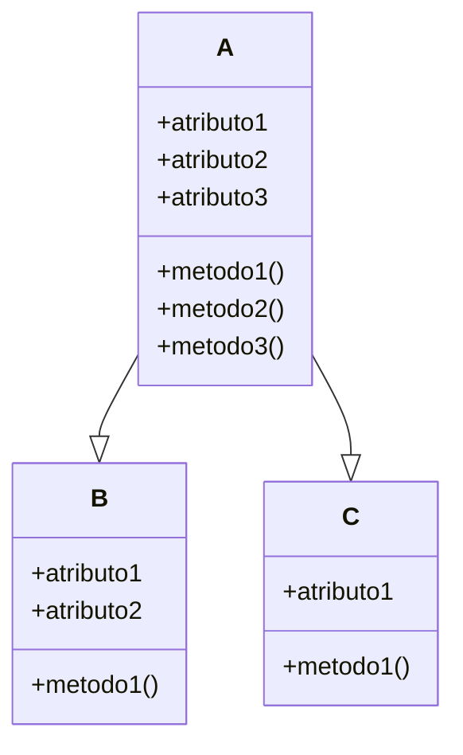
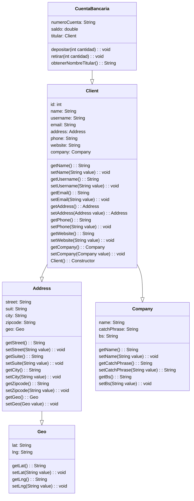

<h4> Bienvenidos, Aqui estaremos adjuntando lo que vallamos avanzando del informe de dependencias </h4>


_*Grafico que muestra como funciona una dependencia*_



```
Como podemos ver en el grafico, las clases 'B' y 'C' dependen de 'A', asi que
cualquier cambio que hagamos en la case 'A', las demas clases tambien seran modificadas.
```

Veamos un ejemplo de como funcionan las dependencias



```
En el grafico mostrado anteriormente, podemos observar como estan constituidas las clases,
vemos que en la clase 'Client' depende de dos clases, llamadas 'Address' y 'Company',
entonces si modificamos alguna de estas dos clases, la clase 'Client' tambien se mirara 
afectada, por otro lado la clase 'Address' depende de otra clase, llamada 'Geo', la cual es 
una clase independiente ya que no necesita de otra clase creada por nosotros, ya que 
cualquier clase que creamos es dependiente de la super clase llamada 'Object'
```
