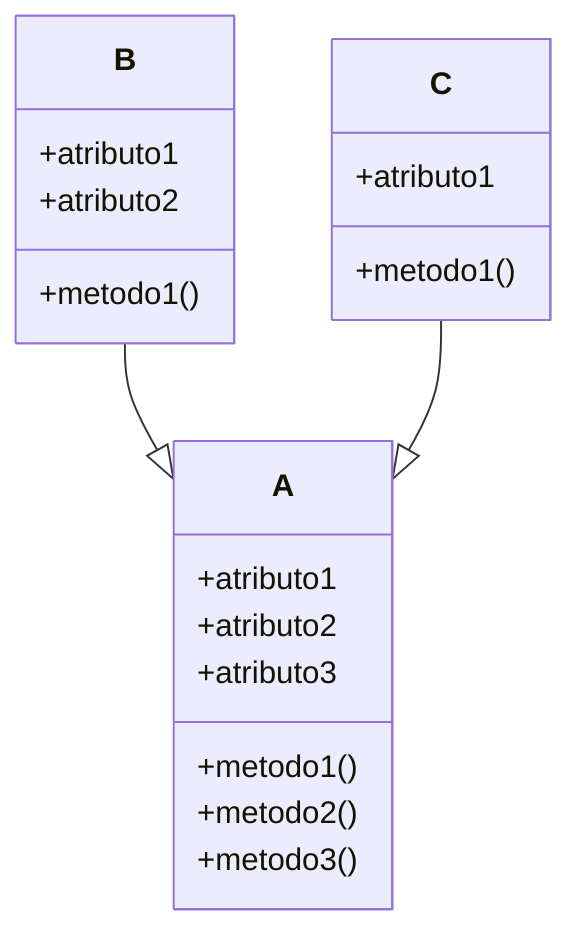
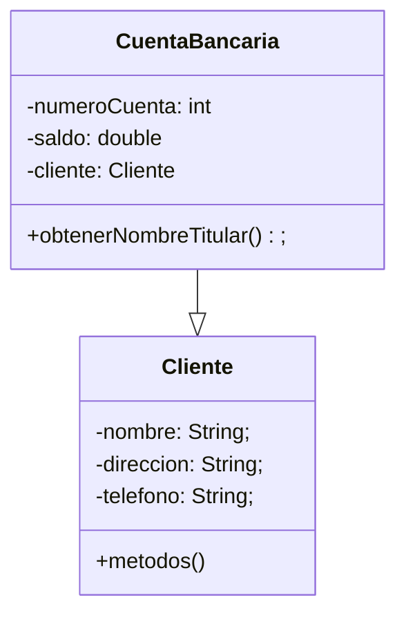

<h4> Bienvenidos, Aqui estaremos adjuntando lo que vallamos avanzando del informe de dependencias </h4>


_*Grafico que muestra como funciona una dependencia*_

<center>

<center>


```
Como podemos ver en el grafico, las clases 'B' y 'C' dependen de 'A', asi que
cualquier cambio que hagamos en la case 'A', las demas clases tambien seran modificadas.
```

Veamos un ejemplo de como funcionan las dependencias


```
En el grafico anterior se crea dos clases, una llamada CuentaBancaria y la otra llamada 
Cliente, donde la clase CuentaBancaria depende de Cliente, esto es porque una cuenta
bancaria debe de tener la informacion de un cliente para poder ser creada
```
_*El codigo de lo anterior se veria asi*_
```java
public class CuentaBancaria{
  private int numeroCuenta;
  private double saldo;
  private Cliente titular; /* Aca hacemos uso de la clase 'Cliente' ahora 
  entendemos que nuestra clase 'CuentaBancaria' depende de un 'Cliente' */

  // Metodos para hacer las operaciones de la tarjeta
  public void depositar(double cantidad){
    saldo += cantidad;
  }
  public void retirar(double cantidad){
    saldo -=cantidad;
  }

  public String obtenerNombreTitular(){
    return titular.getNombre();
  }
}

public class Cliente {
  // Atributos de la clase
  private String nombre;
  private String direccion;
  private String telefono;

  // Metodos Getters de la clase
  public String getNombre(){
    return nombre;
  }
  public String direccion(){
    return direccion;
  }
  public String telefono(){
    return telefono;
  }
  
  // Metodos Setters de la clase
  public void setNombre(String nuevoNombre){
    nombre = nuevoNombre;
  }
  public void setDireccion(String nuevaDireccion){
    direccion = nuevaDireccion;
  }
  public void setTelefono(String nuevoTelefono){
    telefono = nuevoTelefono;
  }
}
```


